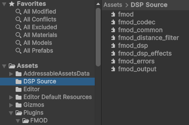

# Fmod-Distance-Filter-for-Android-and-IOS-_-How-to-run-plugin-as-source-code-without-compiling
Here is instruction on how to use bare .cpp plugin for unity ,ue - from fmod programer jeff_fmod. 

You Can static link the source code. Here are the steps to do so:
1. Open the distance “fmod_distance_filter.cpp” file in a text editor and change the fmod.hpp include to fmod.h- this is just for compliance with Unity’s source requirements.

2. In Unity, switch your backend to IL2CPP for both Desktop and Android.
3. Create a new folder in the root of your Assets directory called “DSP Source”.
 

4.Drag the “fmod_distance_filter.cpp” file into this directory.

5. Download the same version of FMOD Engine 1 as your Unity integration. This is so we can include additional source files that fmod_distance_filter depends on.
6. Right click on the FMOD Engine installation and unzip it to your downloads directory.
7. Navigate to “\fmodstudioapi20123win-installer\api\core\inc” and select the following files.

9. Drag them into your “DSP Source” directory.

11. In your FMOD Unity settings, add a new static plugin for your mobile platform with a value of 'FMODGetDSPDescription'

With that, you should be able to build for Android, and your banks should load without issue now that they have access to the fmod_distance_filter source.

This instruction fully copied from https://qa.fmod.com/t/cant-properly-load-vorbis-compressed-bank-help-please/21226/6
thanks to Author is jeff_fmod Programmer

from me: i belive with some changes it can be applied to Unreal engine too. not 100% sure
